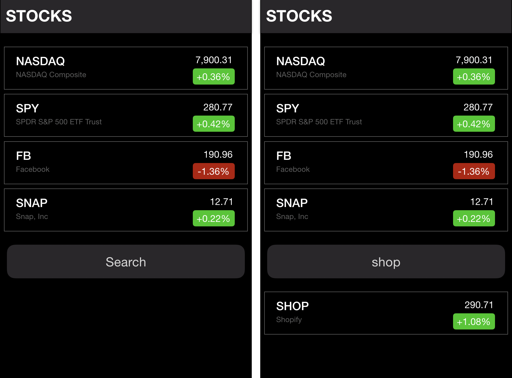

#   SOFTWARE ENGINEERING IMMERSIVE

1. Fork
2. Clone
3. Follow Instructions Closely
4. Submit Pull Request


# [Create React App](https://facebook.github.io/create-react-app)



## Start Here

Inside this repo, run the following command to create a new react app:

```sh
npx create-react-app stocks-app
```

Use `npm start` to start a server that will serve your new React application:

```bash
cd stocks-app
npm start
```
**This will be a mobile-first project.**

This project will use the https://iexcloud.io API to grab stock data. Please signup on the website and grab your API secret/token: https://iexcloud.io/cloud-login#/register

The API URL you will construct will look something like this (**with your key**): https://cloud.iexapis.com/stable/stock/fb/quote?token=sk_63cb8aca56dc4f5687425f679a6b62d2

> Remember to use your own token/secret


Test your API URL on [Postman](https://www.getpostman.com).
You should be able to query a stock on Postman.

Your job will be to implement the following:

1. A Header component
1. A Stocks component

You can do your API call inside of the Stocks component

**Required**
- Your app should resemble the mockup as closely as possible - that means styling, fonts, and colors.
- This project will assess you CSS and Flexbox knowledge.

**Tips:**
- Don't forget to `npm install axios`
- Store the tickers in state, loop through the tickers and make an API call for each ticker
- Use map inside of the Stock component to render each stock

**Bonus**
- Add the ability to save a stock, and when a user navigates to their profile page the saved stocks should appear (this will refresh each time you save in your ide since we haven't set up a server yet, but it will get you ready for when you do! (hint: this involves react-router-dom)
- Build Search
